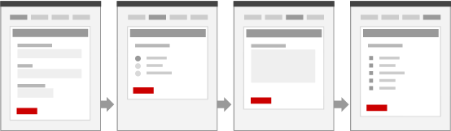
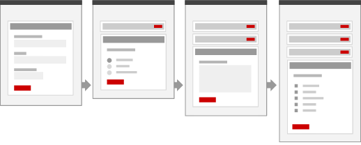
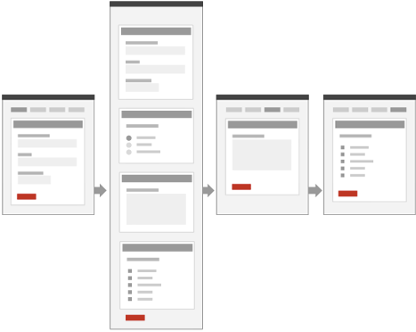

## What is a transaction?

It's an exchange between two or more parties.

[Government transactions](http://transactionsexplorer.cabinetoffice.gov.uk/) typically involve an exchange of information, money, rights, goods or some combination of these. Usually one party will be a citizen or business and the other will be the government.

For example, when someone applies for a passport they exchange information and money for the right to travel.

{:.pad}

A service is made up of a collection of related or connected transactions.

Most digital transactions take the form of a dialogue between the user and a system, which acts on behalf of the other party. It's the system's interface which determines in large part the quality of the overall user experience.

## Choosing the right interface

The dialogue between a user and a system can be realised in different ways. It might resemble a verbal conversation, with the system asking questions and the user answering them. It might be more visual, with the user querying the system by interacting with a map or diagram.

{:.pad}

Either way, you'll need to decide what kind of interface best fits your transaction and how to structure it. It can help people understand how to use your service if you adopt an appropriate design metaphor for your interface.

Interface metaphors can come from the physical or digital world and include things like address book, library, trash can, email inbox, timeline, bank statement, pinboard etc.

Avoid the temptation to go over the top with any physical metaphors (we don't want to see any leatherbound address books with bookmarks sticking out of them).

## How to structure the transaction

You should choose a structure for your transaction that most naturally fits the ways your users are going to want to use it.

Ask yourself:

* Will your users want to move through the transaction in a fixed order, or one of their choosing?
* Will they be able to complete the transaction in a single go?
* Will their answers affect other parts of the transaction?
* Will they want to go back and review or change answers to previous questions?
* Will they need to add or remove items from a list, or change the order of things?
* How many parties are involved in the transaction?
* Do any parts of the transaction take place offline?
* At what point is the transaction regarded as complete?

How you answer these questions will help you decide how to structure the transaction. It can help to think in terms of levels: sections, subsections, groups etc. Try not to worry about how those levels should be represented in the interface until you have a broader understanding of the overall structure.

For example, on a web site, you might choose to have one section per page, or multiple sections per page. It depends on what's going to work best for your users.

## Example structures

### Option 1: Single page

All sections are positioned on a single page.

{:.left}

#### **The good**

* There's only one submit button to press
* A single URL gives access to all form fields
* It doesn't force a fixed order of completion
* You benefit from context of neighbouring sections
* Progress is self-evident

#### **The bad**

* Long forms can be overwhelming and off-putting
* It's less well suited to branching or non-linear flow
* How do you save partial progress?
* Can be harder to track analytics like drop-off rates

---

### Option2 : Wizard

Each section goes on it's own page.

#### **The good**

* It's easier to handle branching and dependencies between sections
* It's easier to let the user save progress
* A long transaction can feel more manageable
* Easier to guide a user through an unfamiliar process
* Easier to capture analytics like drop-off rates for each section

#### **The bad**

* Can be harder for users to see where they are within the transaction
* It can slow users down as they have to click and load each section
* You lose the contextual information from neighbouring sections
* Harder for users to review and edit previous sections
* There's no single place for users to go back and edit their data
* Not a natural fit for non-linear processes like looping, adding and removing

---

### Option 3: Accordion form

All sections on a single page, but each new section only appears once the previous section has been completed.

#### **The good**

* Can handle branching and dependencies between sections
* Can easily review and edit previous questions
* Can help guide a user through an unfamiliar process
* User still benefits from some surrounding context
* Progress is clear

#### **The bad**

* Implementation and interface is more complex

Done well, option 3 is a hybrid of the other two that has benefits of both the other options.
Within this hybrid option there are still some important design decisions to make. For example:

* Will future questions be shown in any way or will you only see the questions you've answered?
* What happens if you go back and edit a previous question?
    * Does the current question stay open or closed?
    * How do you get back to the current question once you've edited a previous one?
    * Do you lose all your answers to questions that follow the one you go back to edit?

### Option 4: Hybrid

For more complicated transactions, some combination of the other options might be your best bet.

Again, done well this can give you the benefits of both the single page and wizard approaches. It also allows you to create a sense of rhythm to the overall flow, which can help people to understand when they have moved into a different part of the transaction, and break up the monotony of filling in forms.

As always, these design decisions must have a strong, user-centred rationale behind them.

## Saving progress

If the average time to complete a transaction is more than you can reasonably expect your users to spend in a single session, then you'll need to provide a way for them to save their progress.

The same goes if the session is likely to be interrupted for some reason. For example, if the user is suddenly asked for information which they might not have immediately to hand (a way to mitigate against this is to warn users up front if they're going to be asked for that kind of information).

Saving progress does not necessarily mean you require user accounts, logins, email validation etc. For simpler transactions that don't store personal information you might be able to store the data in the URL itself. The user then simply has to bookmark that URL.

For more complex transactions that don't store personal data you might be able to offer users a unique, and hard-to-guess URL that they can use to get back to their session.

## Indicating mandatory fields

If you follow the principle of not asking for information you don't need, then most of your fields will be mandatory and you shouldn't need to mark them as such with '*' symbols or other conventions. Instead, mark the optional fields, by adding '(optional)' to their label.

## Helping users

You should be aiming for a service that's so intuitive people don't need any help in using it. If you find yourself explaining the interface *within* the interface it's a sign that something has gone wrong. Time to try out some different ideas.

The following principles may help:

Follow conventions where possible
: Hyperlinks are blue, warnings are red etc.

Use metaphors as a shortcut to understanding
: "Oh, it's like an address book..."

Leverage the context of the surrounding elements
: "I'm on the address page, I must be being asked for an address"

Use familiar language
: eg. 'Registration number' rather than 'Vehicle Registration Mark'

Sometimes though, people are going to need extra help. Many government transactions involve concepts and terminology that people will be unfamiliar with. Some of this stuff takes a lot of explaining - so we need a way of providing contextual help of varying degrees of detail throughout a transaction.

Here are three approaches:

Inline help
: Short, snappy text, positioned near the part of the interface it refers to. If it's something that everyone needs to know, make it permanently visible.

Progressive disclosure
: A fancy phrase for hiding stuff until it's clicked on. Used carefully this is a good way of keeping the interface free from potentially confusing clutter. Only use this for help that's intended for a small subset of your audience (say, less than 10%).

Rich contextual help
: Sometimes you need to give users access to supporting content, in case they're unfamiliar with the terminology or concepts involved in the transaction. This kind of content should probably exist as a GOV.UK guide outside of the transaction, and then be repurposed in some way within the transaction.

## A few principles

Here are a few principles to keep in mind when you're designing transactions.

### 1. Be honest about the proposition

The further in to a transaction someone gets, the more time they have invested in it and the greater their annoyance if they have to abandon it for some reason.

Be honest about what you're offering users, and what you're not offering them. In particular, people need to know up front about the following:

* Any costs involved
* Any waiting periods or delays
* Any uncommon or hard-to-find infomation they'll need to provide
* Any constraints on who can complete the transaction (age, nationality etc.)
* Any equipment that will be required (eg. a printer)
* Any non-digital parts of the transaction

Use common sense though. Don't try to make everyone to read a page of terms and conditions before they start (they won't).

The best approach is to meet (or exceed) people's expectations. For example, if your delivery times are typical and you accept all the usual payment methods then you wont need to warn everyone about them up front.

### 2. Respect the natural flow of the underlying process

For example, if the underlying process is inherently non linear then choose an interface that works well with non-linear processes. If you try to fit a process into a model it's unsuited for you'll confuse your users and confound their expectations.

### 3. Consider all aspects of the user experience

Remembering the broader context in which a transaction exists, including the emotional states of the people involved and the  broader situations or activites that the transaction is embedded in.

### 4. Assume users have no prior domain knowledge

Don't assume that your users already understand all the concepts and terminology used in your transaction. A few people will want to read up on all that stuff before they start, but many will choose to dive straight in. You need to support both types of people.

### 5. Don't ask for information you don't need

Every request for information from the user:

* requires additional physical and cognitive effort on their part
* creates another opportunity for them to get something 'wrong'
* increases the time taken to complete the transaction
* increases the perception that the service is invasive

Asking for information because 'it might be useful' or 'it helps with our record keeping' is not acceptable.

## Resources

* <http://transactionsexplorer.cabinetoffice.gov.uk/>
* <http://www.uxforthemasses.com/forms-usability/>

