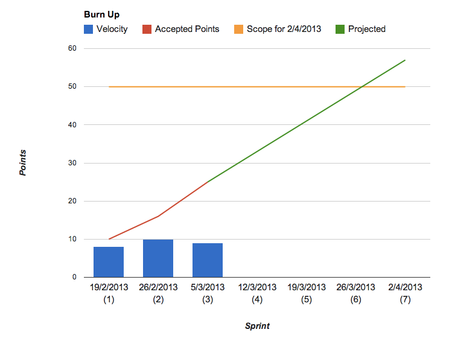

## The importance of delivery managers

The delivery manager (the ScrumMaster in Scrum) is all about setting the team up for successful delivery.  Skilled delivery managers remove obstacles, or blockers to progress, constantly helping the team become more self organising. They enable the work a team does rather than impose how it’s done. It’s not about micro managing!

Equally important in an agile team and particularly important to the delivery manager is continuous improvement. Their role in this is to facilitate project meetings- including daily stand-ups, sprint planning meetings, and retrospectives. They also track progress and produce artefacts for showing this, like burn down/up charts. They must be able to estimate how much effort is required in producing the features the Product Manager wants.   

## Skills

Delivery managers need to have: 

* strong estimation and budget scoping skills 
* experience in Agile Project Management methodologies 
* familiarity with structured programme and project management environments 
* experience delivering digital services 
* experience in open source and cloud technologies and their sourcing

A delivery manager will also need the following skills: 

* strong organisational and communication skills 
* collaborative approach to working 
* good at prioritising time-critical work 
* an understanding of the wider digital landscape 

## Job description templates
[Delivery Manager](https://docs.google.com/a/digital.cabinet-office.gov.uk/document/d/1fF_PnQeSQg75EvJzH316HoSee3J86ywd2j2EcXPbXuE/edit) (Google drive link. You will need permission to view.)

## Further reading
[Good health check](http://www.scrumalliance.org/articles/103-the-managers-role-in-agile) from the Scrum Alliance for delivery managers.

[A day in the life of a delivery manager](http://digital.cabinetoffice.gov.uk/2012/12/12/a-day-in-the-life-of-a-delivery-manager/) - blog
